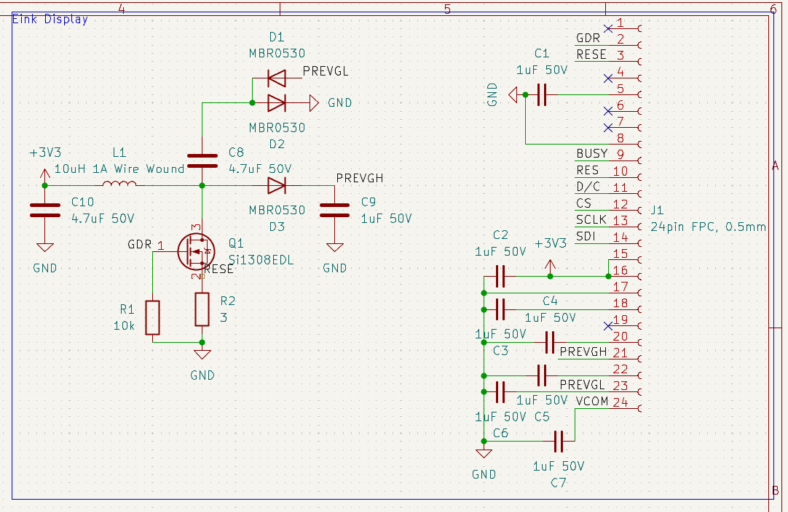

# Day 1 (15th of March 2025)
## Initial Goals
- Be completely phone independent
- Use a Eink display (with builtin circuitry)
- Be based around the RP2040 (Quite high power usage, but powerful and familiar) architecture
- Basic App Launcher
- FreeRTOS?
- Expose I2C, SPI and some GPIO (Space dependent)

## Choosing an Eink Display
Step one, is choosing the eink display that will be used in the project. as this determines:
- Physical Size
- Physical Shape
- Idle current
- Display communication standard

It also needed some basic features
- 2 colour panel (cheaper, easier to use)
- Good software support by libraries like [PicoGraphics](https://github.com/pimoroni/pimoroni-pico/tree/main/libraries/pico_graphics)  and existing display drivers
- A decent refresh rate
- Small (like 1.5" small) and vertical

Looking at Waveshare's site, you get the following options:

I went for the 200x200 1.54" 2 Colour board due to it being cheap and matching my requirements

# Day 2 (16th of March 2025)
## Choosing a battery
My requirements for a battery are quite simple:
- Be 3.7v  
- Be physically small
- Be rechargeable

I decided on part [302530](https://www.aliexpress.com/item/1005008853926414.html) due to it's size.
It does not have free shipping however, as the one with fre shipping was significantly more expensive.

## Other thoughts
- BMS board and main board may need to be seperate because of space. I shoud try to fit it all on one though

## Starting the board design:
I started the design with the part I'm least familiar with (The Eink display interface).
Basing my work on Waveshare's reference diagram (found in their [datasheet](https://files.waveshare.com/upload/e/e5/1.54inch_e-paper_V2_Datasheet.pdf) on page 8.

Aand, this is what I ended up with schematic wise:

I intend to use 0805 or 0603 passives, since they are relatively easy to solder whilst still being small
