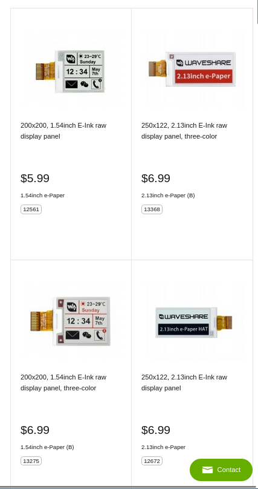

# Day 1 (15th of March 2025)
## Initial Goals
- Be completely phone independent
- Use a Eink display (with builtin circuitry)
- Be based around the RP2040 (Quite high power usage, but powerful and familiar) architecture
- Basic App Launcher
- FreeRTOS?
- Expose I2C, SPI and some GPIO (Space dependent)

## Choosing an Eink Display
Step one, is choosing the eink display that will be used in the project. as this determines:
- Physical Size
- Physical Shape
- Idle current
- Display communication standard

It also needed some basic features
- 2 colour panel (cheaper, easier to use)
- Good software support by libraries like [PicoGraphics](https://github.com/pimoroni/pimoroni-pico/tree/main/libraries/pico_graphics)  and existing display drivers
- A decent refresh rate
- Small (like 1.5" small) and vertical

Looking at Waveshare's site, you get the following options:

I went for the 200x200 1.54" 2 Colour board due to it being cheap and matching my requirements
